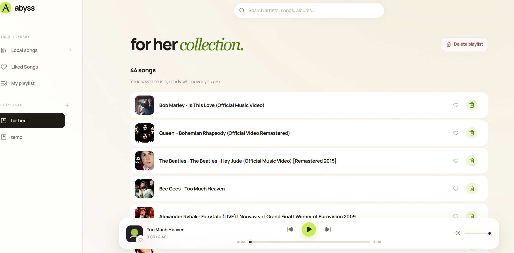
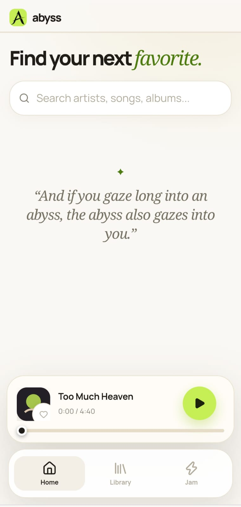

# abyss

A small, private music space to listen together.





## Run locally

```bash
npm install
```

Start the client in one terminal:

```bash
npm run dev
```

Start the YouTube proxy in a second terminal:

```bash
npm run proxy
```

Open the Vite URL shown in the client terminal. `npm run dev:all` is also available as a one-command shortcut.

## Test and build

```bash
npm test
npm run test:coverage
npm run build
```

For a production-style local run, build first and then use `npm start`.
